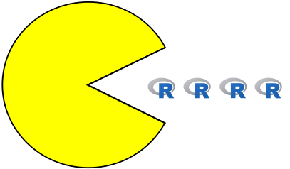

# pacman

[](https://travis-ci.org/trinker/pacman) [](http://dx.doi.org/10.5281/zenodo.15406) [](https://img.shields.io/badge/Version-0.4.4-orange.svg)
[](https://cran.r-project.org/package=pacman)

The [pacman](http://trinker.github.io/pacman_dev/) package is an R package management tool that combines the functionality of base library related functions into intuitively named functions.  This package is ideally added to .Rprofile to increase workflow by reducing time recalling obscurely named functions, reducing code and integrating functionality of base functions to simultaneously perform multiple actions.  




Function names in the pacman package follow the format of `p_xxx` where 'xxx' is the task the function performs.  For instance the `p_load` function allows the user to load one or more packages as a more generic substitute for the `library` or `require` functions and if the package isn't available locally it will install it for you.

## Installation

The user can install from [CRAN](https://cran.r-project.org/package=pacman) via:

```r
install.packages("pacman")
```


You can also download the dev version via [zip ball](https://github.com/trinker/pacman/zipball/master) or [tar ball](https://github.com/trinker/pacman/tarball/master), decompress and run `R CMD INSTALL` on it, or use the **devtools** package to install the development version:

```r
## Make sure your current packages are up to date
update.packages()
## devtools is required
library(devtools)
install_github("trinker/pacman")
```

Note: Windows users need [Rtools](http://www.murdoch-sutherland.com/Rtools/) and [devtools](http://CRAN.R-project.org/package=devtools) to install this way.


## Help

- [Web Page](http://trinker.github.com/pacman/)       
- Vignettes:     
  - [HTML Vignette: Introduction to pacman](http://trinker.github.io/pacman/vignettes/Introduction_to_pacman.html)      
  - [pacman Functions: Quick Reference](http://trinker.github.io/pacman_dev/vignettes/pacman_functions_quick_reference.html) 

## Contact

You are welcome to:
* submit suggestions and bug-reports at: <https://github.com/trinker/pacman/issues>
* send a pull request on: <https://github.com/trinker/pacman/>
* compose a friendly e-mail to: <tyler.rinker@gmail.com>

## Installing, Loading, Unloading, Updating, & Deleting Packages with pacman 

**Quick Reference Table** 

| pacman Function | Base Equivalent | Description |
|----------------------|----------------------|----------------|
| `p_load`  |  `install.packages` + `library` | Load and Install Packages |
| `p_install` |  `install.packages` | Install Packages from CRAN |
| `p_load_gh`  |  NONE | Load and Install GitHub Packages |
| `p_install_gh` |  NONE | Install Packages from GitHub |   
| `p_install_version` |  `install.packages` & <br/> `packageVersion` | Install Minimum Version of Packages |
| `p_temp` |  NONE | Install a Package Temporarily |
| `p_unload` | `detach` | Unload Packages from the Search Path |
| `p_update` | `update.packages` | Update Out-of-Date Packages |
